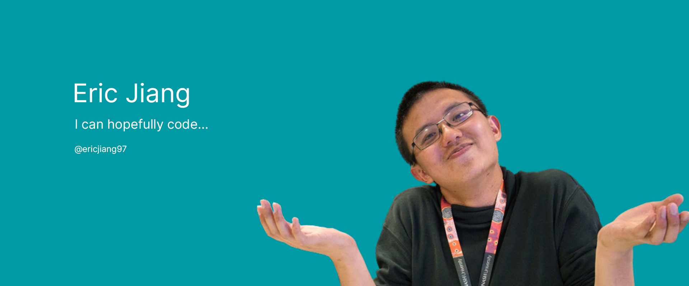

### Hi there 👋, I'm Eric

_He/him_ | https://ericjiang.dev | eric@ericjiang.dev

#### I’m currently a Test Engineer at Google.

As a Test Engineer within the Script Automation Team (QMC, Pixel Software), I work on automation tools, as well as shaping better processes to enable development on both software and hardware engineering teams to build delightful, stable and secure products for everyone.

---

Some of my cool open sourced stuff includes

- :frog: [GeckoDM](https://github.com/GeckoDM/GeckoDownloadManager)
- :computer: [MARIE.js](https://github.com/MARIE-js/MARIE.js)

<!--
**ericjiang97/ericjiang97** is a ✨ _special_ ✨ repository because its `README.md` (this file) appears on your GitHub profile.

Here are some ideas to get you started:

- 🔭 I’m currently working on ...
- 🌱 I’m currently learning ...
- 👯 I’m looking to collaborate on ...
- 🤔 I’m looking for help with ...
- 💬 Ask me about ...
- 📫 How to reach me: ...
- 😄 Pronouns: ...
- ⚡ Fun fact: ...
-->
